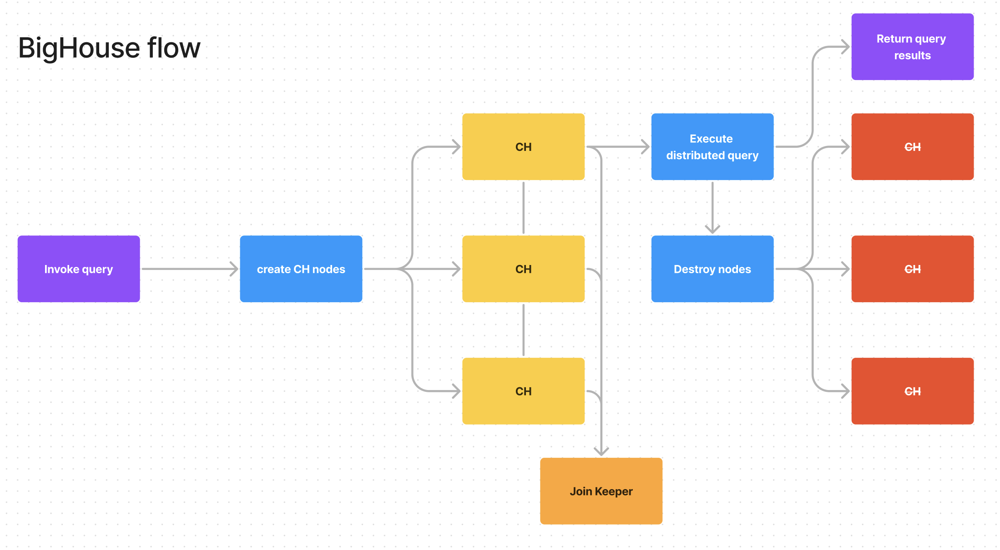

# BigHouse


## Why (WIP)

You can get way more resources. EC2 the largest realistic machine you will use is 192 cores (*6a.metal), and that’s insanely expensive to run ($7.344/hr), especially paying for idle, boot, and setup time.

With fly.io you can spin up 30x 16vCPU machines (480 total cores), execute a query, and destroy the machines in 15 seconds. That query cost less than $0.09 to run (maybe an extra cent for R2 api calls).

With 30 saturated 2Gbit nics and 10:1 avg compression, that ends up being 2gbit * 10 ratio * 30 nics * 15 seconds = 9Tbs or 1.125TB/s. If the query processing itself took 10s, that’s 11.25TB of data. If that was run on BigQuery it would cost 11.25TB*$5/TB=$56.25, on TinyBird $0.07/GB*11,250GB = $787.5 (to be fair that’s absolutely not how you are supposed to use tinybird, but it is the closest thing clickhouse-wise).

For 15 seconds that EC2 instance would cost $0.03 for 192 cores. Multiply by 2.5x to get to 480 cores and that's already $0.075, nearly the same cost, but you haven't considered the 30s first boot time (or 10s subsequent boot times), the cost of the disk, etc.

## How to run

Easiest way is to just use a test, it will download and execute temporal for you. You do need Taskfile though.

```
task single-test -- ./temporal -run TestQueryExecutorWorkflow
```

`.env` file should look like:

```ini
FLY_API_TOKEN=xxx
FLY_APP=xxx
ENV=local
DEBUG=1
PRETTY=1
TEMPORAL_URL=localhost:7233
```

## Web Table Performance

`max_download_threads` and `max_download_buffer_size` will determine how concurrent downloading files are with `s3(Cluster)`

### TLDR:

16vCPU 32GB fly machines (ams region) to S3 eu-central-1

```
SELECT sum(commits), event_type FROM github_events group by event_type

1 node: Query complete in in 32.29385382s
4 nodes: Query complete in in 8.413694766s
6 nodes: Query complete in in 5.938549286s
10 nodes: Query complete in in 4.186387433s
20 nodes: Query complete in in 4.114086397s
30 nodes: Query complete in in 9.618825346s (it was hard to even get these)
```

### Table of observations (not run with BigHouse, but just clustering in general)

| Query                                                                    | Single node                                                                                         | Cluster                                                                                                                                                                                                                                                                                   | Notes                                                                                  |
|--------------------------------------------------------------------------|-----------------------------------------------------------------------------------------------------|-------------------------------------------------------------------------------------------------------------------------------------------------------------------------------------------------------------------------------------------------------------------------------------------|----------------------------------------------------------------------------------------|
| `SELECT uniq(repo_name) FROM github_events`                              | `Elapsed: 34.991 sec. Processed 5.06 billion rows, 10.09 GB (144.59 million rows/s., 288.43 MB/s.)` | `Elapsed: 14.015 sec. Processed 5.06 billion rows, 10.09 GB (360.99 million rows/s., 720.09 MB/s.)`                                                                                                                                                                                       | 16vCPU 32GB fly machines (ams region) to S3 eu-central-1, 6 replicas                   |
| `SELECT sum(commits), event_type FROM github_events group by event_type` | `Elapsed: 2.279 sec. Processed 5.06 billion rows, 25.30 GB (2.22 billion rows/s., 11.10 GB/s.)`     | `Elapsed: 4.994 sec. Processed 5.06 billion rows, 25.30 GB (1.01 billion rows/s., 5.07 GB/s.)`                                                                                                                                                                                            | Slowdown either due to coordination overhead and/or distance from S3                   |
| `SELECT sum(cityHash64(*)) FROM github_events`                           | `Elapsed: 846.170 sec. Processed 5.06 billion rows, 2.76 TB (5.98 million rows/s., 3.26 GB/s.)`     | With 50 parallel replicas: `1 row in set. Elapsed: 18.719 sec. Processed 5.06 billion rows, 2.76 TB (270.28 million rows/s., 147.48 GB/s.)`  With 100 parallel replicas: `1 row in set. Elapsed: 11.286 sec. Processed 5.06 billion rows, 2.76 TB (448.27 million rows/s., 244.61 GB/s.)` | m5.8xlarge in AWS with VPC endpoint, shows ideal in-network performance is near linear |


16vCPU 32GB fly machines (ams region) to S3 eu-central-1, 6 replicas

```
-- no replicas
SELECT uniq(repo_name)
FROM github_events
SETTINGS max_parallel_replicas = 1, allow_experimental_parallel_reading_from_replicas = 0, prefer_localhost_replica = 1, parallel_replicas_for_non_replicated_merge_tree = 0

1 row in set. Elapsed: 34.991 sec. Processed 5.06 billion rows, 10.09 GB (144.59 million rows/s., 288.43 MB/s.)

-- enable parallel replicas
SET allow_experimental_parallel_reading_from_replicas = 1, use_hedged_requests = 0, prefer_localhost_replica = 0, max_parallel_replicas = 10, cluster_for_parallel_replicas = '{cluster}', parallel_replicas_for_non_replicated_merge_tree = 1;

-- with replicas
SELECT uniq(repo_name)
FROM github_events

1 row in set. Elapsed: 14.015 sec. Processed 5.06 billion rows, 10.09 GB (360.99 million rows/s., 720.09 MB/s.)
```

Efficient query:

```
-- No replicas:
SELECT sum(commits), event_type
FROM github_events
group by event_type
SETTINGS max_parallel_replicas = 1, allow_experimental_parallel_reading_from_replicas = 0, prefer_localhost_replica = 1, parallel_replicas_for_non_replicated_merge_tree = 0

Elapsed: 2.279 sec. Processed 5.06 billion rows, 25.30 GB (2.22 billion rows/s., 11.10 GB/s.)

-- subsequent runs are faster due to caching:
Elapsed: 1.841 sec. Processed 5.06 billion rows, 25.30 GB (2.75 billion rows/s., 13.74 GB/s.)

-- Parallel replicas
SELECT sum(commits), event_type
FROM github_events
group by event_type

Elapsed: 4.994 sec. Processed 5.06 billion rows, 25.30 GB (1.01 billion rows/s., 5.07 GB/s.)
```

As you can see with extremely fast queries, the overhead of distributing the work seems to degrade performance by half. This is also a simpler operation. This is probably also exacerbated by the distance to S3.

The worst performing query (ec2 in eu-central-1), but highlights max parallelism (thanks to Alexey for testing this):

```
SELECT sum(cityHash64(*)) FROM github_events

Without parallel replicas:
1 row in set. Elapsed: 846.170 sec. Processed 5.06 billion rows, 2.76 TB (5.98 million rows/s., 3.26 GB/s.)

With 50 parallel replicas:
1 row in set. Elapsed: 18.719 sec. Processed 5.06 billion rows, 2.76 TB (270.28 million rows/s., 147.48 GB/s.)

With 100 parallel replicas:
1 row in set. Elapsed: 11.286 sec. Processed 5.06 billion rows, 2.76 TB (448.27 million rows/s., 244.61 GB/s.)

SELECT sum(cityHash64(*)) FROM github_events
SETTINGS max_parallel_replicas = 1, allow_experimental_parallel_reading_from_replicas = 0, prefer_localhost_replica = 1, parallel_replicas_for_non_replicated_merge_tree = 0
```

As you can see with fly, the bottleneck is network access. Once storage is within the local network (or very close, same country) then performance skyrockets even further

## How does it work



## Primitive Performance Test

96 CSV files:
```
➜  dangoodman: ~ aws s3 ls --no-sign-request s3://altinity-clickhouse-data/nyc_taxi_rides/data/tripdata/ | wc -l                               4:57PM
      96
```

Nodes in `iad` fly.io region.

```
[6] Nodes ready in 3.221804869s
```

VERY unoptimized CH image. The more nodes the higher the chance it takes longer. iad I'm getting typically 3-5s for 6 nodes.

Single node:
```
SELECT count() FROM s3('https://s3.us-east-1.amazonaws.com/altinity-clickhouse-data/nyc_taxi_rides/data/tripdata/data-*.csv.gz', 'CSVWithNames',
'pickup_date Date, id UInt64, vendor_id String, tpep_pickup_datetime DateTime, tpep_dropoff_datetime DateTime, passenger_count UInt8, trip_distance Float32, pickup_longitude Float32, pickup_latitude Float32, rate_code_id String, store_and_fwd_flag String, dropoff_longitude Float32, dropoff_latitude Float32, payment_type LowCardinality(String), fare_amount Float32, extra String, mta_tax Float32, tip_amount Float32, tolls_amount Float32, improvement_surcharge Float32, total_amount Float32, pickup_location_id UInt16, dropoff_location_id UInt16, junk1 String, junk2 String',
'gzip')

Completed query in 143.243 sec
```

It was clear that this was pretty CPU-limited for a lot of the query

6 Nodes:
```
SELECT count() FROM s3Cluster('{cluster}', 'https://s3.us-east-1.amazonaws.com/altinity-clickhouse-data/nyc_taxi_rides/data/tripdata/data-*.csv.gz', 'CSVWithNames', 
	'pickup_date Date, id UInt64, vendor_id String, tpep_pickup_datetime DateTime, tpep_dropoff_datetime DateTime, passenger_count UInt8, trip_distance Float32, pickup_longitude Float32, pickup_latitude Float32, rate_code_id String, store_and_fwd_flag String, dropoff_longitude Float32, dropoff_latitude Float32, payment_type LowCardinality(String), fare_amount Float32, extra String, mta_tax Float32, tip_amount Float32, tolls_amount Float32, improvement_surcharge Float32, total_amount Float32, pickup_location_id UInt16, dropoff_location_id UInt16, junk1 String, junk2 String', 
	'gzip')

Completed query in 38.804 sec
```

Noticed that despite having 96 cores, there were only 50-something S3 readers. Created issue for CH here: https://github.com/ClickHouse/ClickHouse/issues/52437 (give it a 👍!)

## PoC

The PoC uses docker compose to create a Keeper node and ClickHouse cluster, poll for expected cluster state, then:

```
bash run.sh
```

## Connect to fly internal network from your device

```
fly wireguard create personal iad idkpeer
```

Then use with wireguard app.

